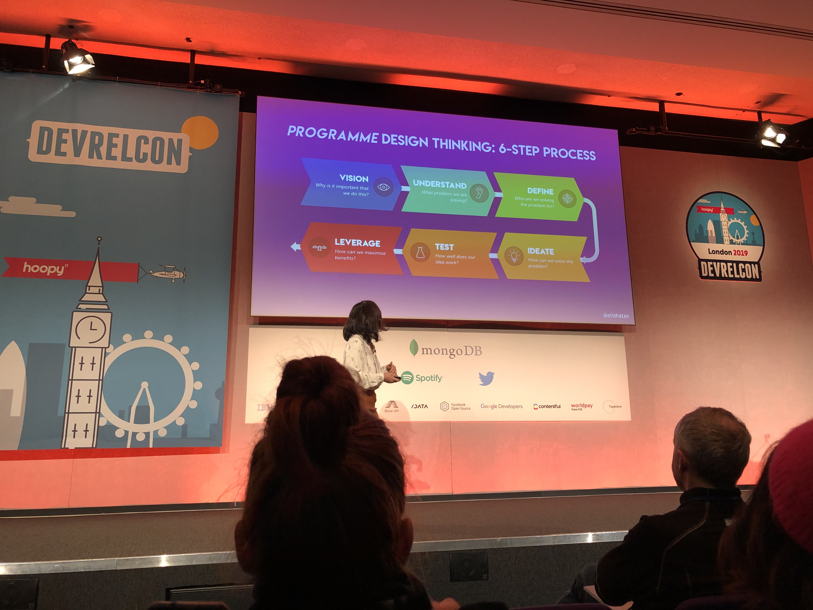
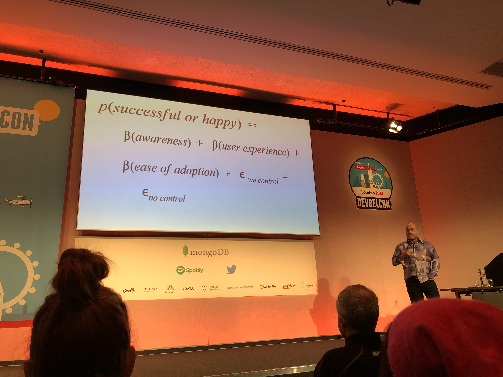
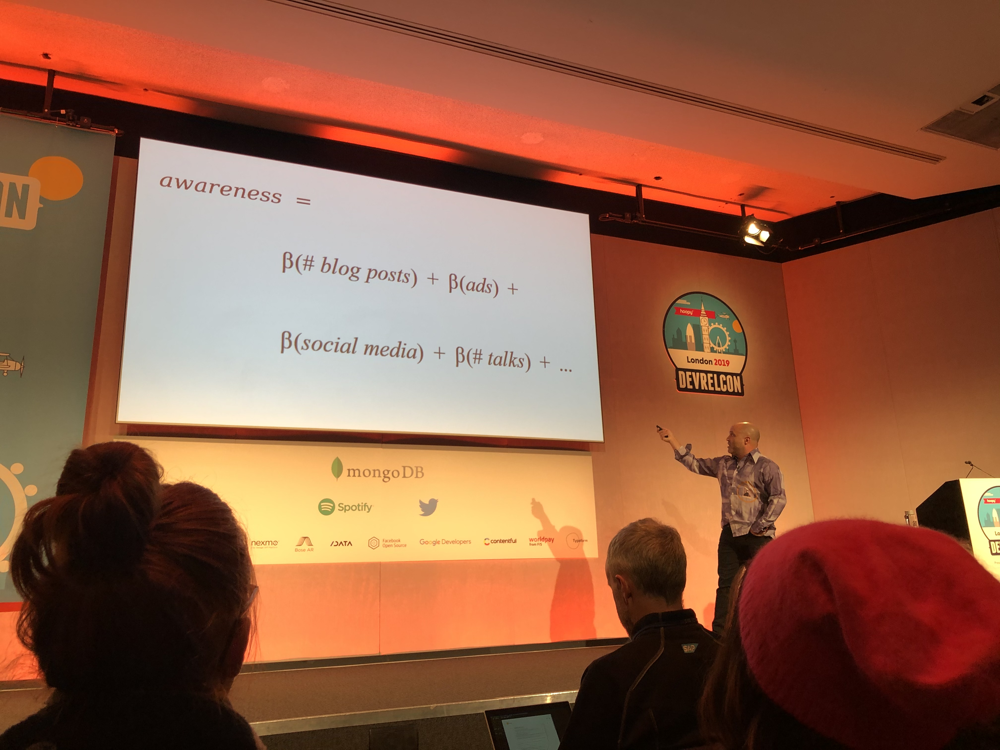
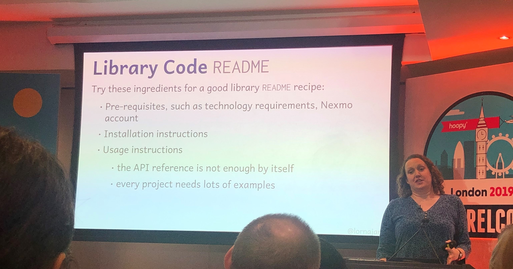
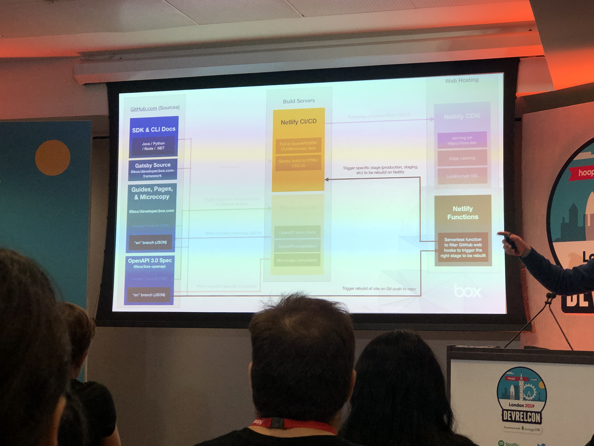
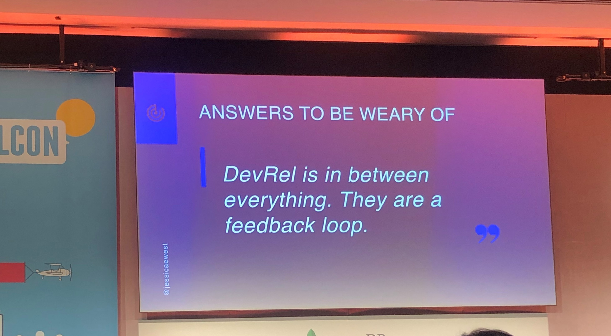
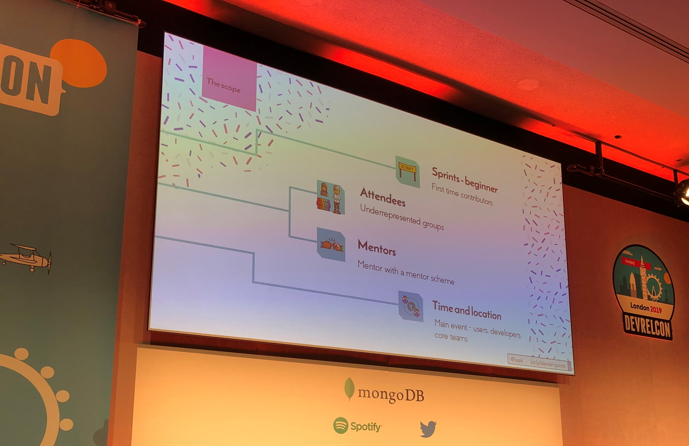
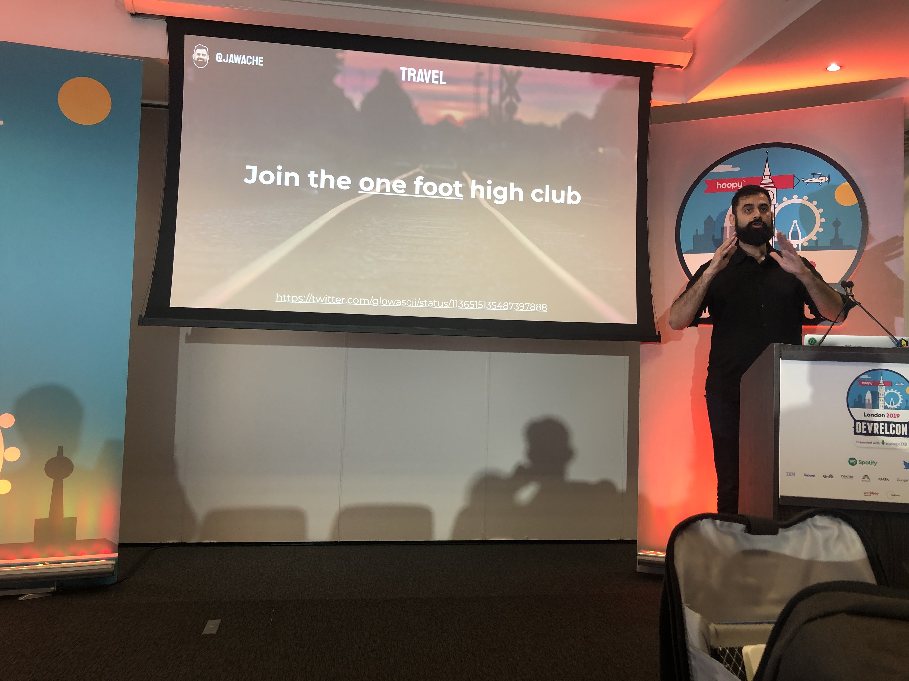

# DevRelCon 2019, London - Event Notes by Nick Trogh & Floor Drees

## General Feedback

A common theme during the conference was about about **making the DevRel profession more _professional_**, how to create developer programmes, and how to measure our results and impact. There was unanimity that we need to become more professional, however there were different perspectives on how to achieve this. It was also apparent that DevRel means different things to different people.

From a community perspective, there was a big focus on **how to create and support inclusiveness and diversity in developer communities**. From an industry point of view we still have a long way to go, and it is great to see the DevRel community acknowledge these issues and taking action. In that respect, it was great to see that the audience of DevRel professionals was very diverse itself.

It was also telling that there were two keynotes about **mental health in the DevRel community**. It shows that we're in a very demanding industry, moreover that community management itself can exacerbate stress levels even more.

We're all busy people, but once the talk recordings are published, **make sure to check out**:
1. Open Source is Broken (Don Goodman Wilson)
2. Bring more intention - Formalizing more of our work (Steve Pousty)
3. Don’t create, re-use! How to repurpose a common business metric for your team’s success (Mary Thengvall)
4. How DevRel is failing communities (Florian Gilcher)
5. Mentored sprints for diverse beginners (Tania Allard)

**Microsofties present**: Martin Woodward (@martinwoodward, Principal GPM for Azure DevOps), Sarah Thiam (@truckerfling, CA PM APAC), Sy Brand (@TartanLlama, CA), Asim Hussein (@jawache, CA), Tania Allard (@ixek, CA).

**Other observations:**
- [The Curb-Cut Effect](https://ssir.org/articles/entry/the_curb_cut_effect) was a recurring theme at DevRelCon, for a11y as well as distributed teams ("everyone benefits from accessibility").
- Very many people sported the “Drop ICE” pin, GitHub stickers largely remained untouched on the sticker swap table, and GH didn’t sponsor a track this year which is… curious.

**Other write-ups:**
- https://medium.com/@alexsimonjones/five-things-i-learned-attending-devrelcon-2019-c692fe20f39c?

# Day 1

## Keynote: Design thinking methodology: how do you design programs for diversity? (Elisha Tan @elishatan - founder TechLadies)

Tech talks, hackathons, webinars, workshops.. With so many ways to engage with developers, how do you decide on how and what to do in order to achieve specific goals? We typically dive immediately into ideation, focusing on how to solve a problem, rather than considering the context in which the problem occurs. Product design thinking is a well-defined 6-step process, which provides structure and holistic approach, which can be applied to implementing developer programmes or initiatives.

The design thinking process applied to developer programmes consists of:
- **Vision**: why are you doing this, what are your goals, what are the desired outcomes?
- **Understand**: what is the problem, how are people solving this right now, why are current solutions inadequate? This step requires doing research.
- **Define**: who is the target audience, what are their dreams and challenges, where can you reach them? The use of user persona helps define your target audience without looking at specific individuals.
- **Ideate**: what are all the possible ideas, which is the best idea, what idea gives you shortest feedback loop?
- **Test**: what is the best way to test this, what are the risks involved, what did you learn? Testing methods are surveys, creating prototype, running a small-scale event.
- **Leverage**: what other values can you extract, what other goals can you achieve?

So: not just acting upon the whims of your community then. Bootcamps that span x months don't allow for one to keep a fulltime job, which impacts the type of participants you can attract. Event times may conflict with cultural expectations - women out of the house after a certain hour, no less surrounded by men, could be problematic.

Techladies learned early on that a portfolio is a great spring board for a career in tech, much more so than a collection of small prototypes. Which is why participants work on a project for a non-profit that will actually be used.

## Keynote: Bring more intention - Formalizing more of our work (Steve Pousty) 

Steve (@TheSteve0) is the Director of Developer Relations at CrunchyData (Postgres folks).

How can we use models to manage DevRel intentionally? Inherently all models are wrong, because they portray an abstraction of reality and hence constrain our world view. We filter reality so we can comprehend it, we are always making models. At the same time, while models contrain how you view the world, language needs contrains to work. You can't opt out of models, however flawed. you can however bring attention and intention to your models,

Specifically for DevRel, an often-used model is the **funnel**. There are several flaws with this model:
- it constrains us in thinking developers move along a **linear flow** (see also how MS Corp moved to the Discover-Explore-Adopt-Develop model).
- we refer to **gut-feeling** for the conversion ratios in the different phases of the funnel.
- there is **no notion of error** in the model.

We need to create models that are intentional, which are based on tangible activities, and which rely on quantifiable, proven statistical models. Consequently, these models also have an inherent notion of error in them, acknowledging uncertainty in our execution.

Looking specifically at DevRel, how can we create a model for success? The model will consist of the following components:
- awareness
- user experience
- ease of adoption
- error factor which we control
- error out of our control

As we put more/less investment in these components, our success rate will be influenced, based on statistical models, and thus will be more reliable.

Speaker slides: https://speakerdeck.com/elishatan/design-thinking-how-do-you-design-developer-programmes

## Inspiring and empowering users and techies to become great writers, and why that’s important (Jo Cook)

Users are best placed to write documentation, as they know the needs and expectations for who actually uses the documentation. Developers make assumptions, miss out steps or use technical terms and jargon.

**Better documentation -> Bigger and more diverse communities -> New developers -> Less burn-out at the top -> Win for everyone**

How do we entice users to participate in writing documentation? How do you lower the barriers to entry? Is it easy for newcomers to contribute, for example because of complex tooling, workflows)? How welcoming is it for contributors?

A better solution consists of:
- lower barrier to entry by using easy tooling (e.g. 'Edit on GitHub'), providing easy workflows and templates
- put contributions live as quickly as possible as an acknowledgement and encouragement
- attract and nurture existing writers

Reference example: [The Good Docs Project](https://thegooddocsproject.dev/)

Speaker notes: https://archaeogeek.com/blog/2019/12/15/devrelcon2019/

## Don’t create, re-use! How to repurpose a common business metric for your team’s success (Mary Thengvall)
Mary Thengvall (@mary_grace), now DevRel at Camunda, author of “The Business Value of Developer Relations: How and Why Technical Communities Are Key To Your Success”, on repurposing common business metrics - like Qualified Leads - for your #DevRel team’s success:

Qualified leads is an accepted term in the business world, context is clear - definition is: the number of people you met and connected to various parts of the business.

- Marketing: case study or guest content
- Product: feedback & beta testing
- Engineering: hard-to-solve bugs
- Biz dev / Partner: integrations
- Recruiting: potential new hires
- Sales: Potential new customers

Doesn't need to be the only metric, but maybe the leading metric. Enabled developers are productive, less likely to churn, and more likely to champion your products.

## GitHub is your documentation landing page (Lorna Jane Mitchell)

Users typically go straight to the code and not to documentation pages. How can you make your documentation landing page on GitHub as compelling as possible.

- The **Readme** page is being rendered automatically on GitHub, but also on package manager repository sites.
- Minimum items to mention as part of your landing page: **project title, short project description, purpose and scope**
- Additional items: **links to documentation pages and other resources**
- To connect users to your company and products, add a link to a product signup page, optionally using a tracking url to get more insights on effectiveness of your landing page.

To welcome participation and inclusiveness, ensure that you also have a CoC and Contribution document included in the repo.

The type of information in the technical documentation **depends on the type of repo**. Types of repos could be: Library project, Tool/Demo app, supporting code (e.g. for a blogpost). For each of these, other or more detailed information needs to be provided.

Repository standards: https://github.com/nexmo/repo-standards

## Operator disconnected: is developer relations forgetting the people who run the software in production?

Luke Kilpack (@lkilpatrick), Senior Manager of DevOps Marketing (which is apparently a thing) Nutanix, and Max Lavi (@calm_mark), Principal DevOps Advocate. Nutanix is a Cloud infra company I previously never heard of.

Is developer relations forgetting the people who run the software in production? Luke and Max prefer *Continuous Delivery* over *Continuous Development*. Businesses expect "cloud-like" output. But for that we need to pamper not only dev, but certainly also ops. Spinning up a machine might just take minutes or seconds, but likely 6 weeks of governance prequals that. Lift and shift is just moving binaries around. In itself its not delivering business value.

The two talked about App Week at Atlassian where dev would teach ops about writing APIs, and ops teach dev how to run their own stuff.

## From bits & docs to experiences & publishing: modernizing Red Hat’s enterprise developer program
 
Joe Schram (@joeschram), Principal Product Marketing Manager  Red Hat Developers, on evolving Red Hat’s enterprise developer program. [jschrm.co/devrelcon2019](https://jschrm.co/devrelcon2019) for slides and **templates**. 

In 2019 developers.redhat.com requires no prior knowledge of the product line. Their audience: "someone who puts their hands on our products to solve personal and professional challenges" (makers).  Red Hat differentiates between people who build, and people who build on (top of). For Red Hat the latter is a mid-career Java developer in the enterprise. 

Joe's devise: "Fall in love with your audience's problem, not your product." Orient (navigation) around technologies / upstream solutions (ie Kubernetes), instead of product names. Learning trumps teaching.

## Docs as engineering: an intro to developer experience engineering (Cristiano Betta)

Stepping up from Docs as Code to Docs as Engineering by applying the same engineering process flow as you would for source code. The goal of this is to ensure quality, maximize value, speed up delivery and encourage responsibility.

Tooling to improve documentation quality:
- [Spectral](https://stoplight.io/open-source/spectral/)
- Run spell checkers on your Open API documentation
- [Alex.js](https://alexjs.com/) to check for insensitive, inconsiderate writing
- Testing your documentation (e.g. do cross-reference links work)
- Modularize OpenAPI specs into separate files - also makes it more welcoming for new contributors.

Automated documentation pipeline:
- Trigger validation and compilation of microcopy (JSON) and OpenAPI specs on Git push
- Leverage Netlify and Gatsby to host the documentation pages
- Generate Postman collections
- Update SDKs and CLIs (future)
- Generate documentation changelogs

## Get executive buy-in … or else (Jessica West)

To get executive buy-in for our DevRel activities, we need to understand the perspective of the executives and **what your value is to the executive team**.

A number of key questions can reveal this:

- What is the overall value of DevRel?
    - Why is DeveRel important to you and what value does it bring?
    - What are you looking to get out of DevRel?

- What are success factors for DevRel?
    - What does a successful DevRel person/team look like to you?
    - How are you measuring things? (#dev engagements, #SDK downloads, #people at events, etc.)
    - What does success look like to the board?

Implementing a strategy:
- Program for initiatives, which have a clear owner and outcome
- Setup measurements
- Communicate about the initiatives to the stakeholders (e.g. internal newsletter, speak at company all-hands, internal wiki, sit-in other department meetings, etc.)

> You're never too small of a team to have a strategy and process!

## How to scale a developer relations team (Uttam Tripathi @tripathiuttam)

Uttam, Head of Global Programs Dev Ecosystem at Google, on scaling your DevRel:
Focus on hubs (for you, those might differ from the usual suspects), don't get spread to thin, hire local experts and decentralize swag. When it comes to gathering feedback from your community members it's ok not to scale.

## Crafting universally good docs (Sangeetha Alagappan)

Sangeetha is a Technical Writer at Google. How do we ensure that developers, with disabilities or otherwise, have a *good* experience with a product’s docs and UI? Good documentation is like a love-letter to your future self. This is something Lieke Boon (@Lieke2208, ex GitHub, now with MongoDB) re-iterated on Day 2, when she talked about taking over the award-winning GitHub Campus Experts program from Joe Nash (@jna_sh).

And: everybody wins when you invest in #a11y.

Recources: Google’s developer documentation style guide, Pinterest’s product design best practices, Vox’s a11y guidelines, and Rob Dodson’s a11ycasts

## Empathy flavoured docs: A recipe with human values (Vishwa Mehta)

Vishwa (@VishwaMehta30) is a Tech Writer at SundayPyjamas. With the tech community moving on from being insensitive, biased, racist, ableist, towards a more human centric, diverse, inclusive, and empathetic outlook, it's high time we reflect this positive change in our docs. Good code is not self-documenting, however persistant this meme seems to be. 

Resources: 
[slides.com/bolajiayodeji/effective-os-docs#/9](https://slides.com/bolajiayodeji/effective-os-docs#/9) 
[docs.microsoft.com/en-us/contribute/?WT.mc_id=docsmsft-twitter](https://docs.microsoft.com/en-us/contribute/?WT.mc_id=docsmsft-twitter) (“Microsoft Docs contributor guide overview”)
[selfdefined.app/](https://www.selfdefined.app/) 
[a11ywithlindsey.com/blog/accessibility-conferences/](https://www.a11ywithlindsey.com/blog/accessibility-conferences/) (“10 ways to help Accessibility at Conferences as a speaker”)
... and [Alex JS](https://alexjs.com/) - a linter to find insensitive, inconsiderate language.

## Commit Messages vs. Release Notes (Eva Parish)

Eva (@evpari) is a Senior Technical Writer Squarespace, and notes: commit messages and release notes are both important, but not the same thing. And they’re not for (present) you. Rather than a changelog dump, release notes are a high-level summary of changes & impact to your users.

## Passion … like magnets, it can attract or repel (Baruch Sadogursky)

Baruch (@jbaruch) is jfrog's Head of DevRel. "People think their challenges and context are unique and really only learn from their own mistakes, not yours." But that doesn't keep Baruch from sharing his insights in how cultural differences play a big role in the effectiveness of your DevRel strategy. Don't be like past-Baruch and double-down on how great your product is, or interrogating your convo partner. 

## The art of story design (Melinda Seckington)

You should design your story to have the most impact. The speaker based her approach on the model outlined by [Paul Smith's book "Lead with a story"](https://www.goodreads.com/book/show/13132771-lead-with-a-story). In this model, a story has context -> action -> result.

**Context**:
- Setting the scene of the story, providing background
- Grab the audience attention by providing a hook (first 30 seconds) and describing the goal.

**Action**:
- Cover the right content to get to the goal outlined before: *protagonist, journey, conflict*
- Protagonist: define your hero and allow the audience to be the hero in their story (identify) - tune the story to the audience
- Journey: a rising action and obstacles to be overcome - keep information together that belongs together
- Conflict: what is stopping people from getting to the result

**Result**:
- Cover how to get to the solution, resolve the conflict
- People remember the end of the story - end with a bang
- Recap what they learned

## How to get the most from running hackathons (Kevin Lewis)

What are hackathons? 
- Invention marathons
- Challenge that needs to be solved in a fixed amount of time

Hackathons need to have a goal - based on the type of hacakthon, there will be different goals:
- R&D
- Building communities around a theme or cause
- Driving adoption
- Gathering product/service feedback
- Recruitment - note that not everyone performs well in this context
- Supporting sales
- Increase skills (internal hackathons)

## Using external events to bolster internal community building (Alison Yu)

This talk was about how Indeed leveraged presence at external events to create internal communities. Very much a sponsor session...

Sponsoring conferences:
- Incentivise employees to attend: OSPO pays for the T&E
- Help to get speaker slots, provide presentation decks, reviews, training
- Lead collectioning through an opt-in talent portal

## Open Source is Broken (Don Goodman Wilson)

Don (@DEGoodmanWilson, [ex GitHub](https://twitter.com/DEGoodmanWilson/status/1201785950852059138), board member [Maintainerati](https://maintainerati.org/) - an unconference for open source software maintainers) on the house of cards that is open source. 

Imagine worst case scenario for your software and act on that knowledge (because all code is political). Open source prioritizes the wants of consumers, over the need of creators. Open Source exacerbates existing injustices. And being able to participate in OSS is a privilege (of time, education, understanding of the English language).

Don quotes Adrian Cockcroft’s, VP of Cloud Architecture Strategy at Amazon, very troubling take: 
Open source business is *using* the developer community as a force multiplier for engineering: it means they don’t have to invest as much in engineering as if they were doing 100% of this themselves, because the *community is actually doing some of their engineering for them*... and then you take the enthusiasm of these people, and you *use* that to create market awareness, and you invest in that market, so now you’ve got your marketing… you’re *using open source* to magnify your effect on the marketing side. 

People that want to restrict the use of their code to those who don’t (strictly) do harm, are met with the “That’s not open source” argument. Even the OSI (Open Source Initiative) confirmed that open source means anyone can use it, also “evil people”. Don doesn't agree and quit his job over GitHub's contract with ICE, and the response (or lack there of) from GH leadership. He no longer felt like he could advocate for the company. Slides for his talk are on [bit.ly/ethical-resources](http://bit.ly/ethical-resources). His brilliant article on the matter is up on [dev.to](https://t.co/bMICATfZGV?amp=1). More links: the [open letter to GH leadership](https://t.co/fEQxZLjtPD?amp=1), and the [@githubbers activist Twitter account](https://twitter.com/githubbers).

# Day 2

## Why corporate dev rel teams must act like a startup (Mo Haghighi)

Mo (@mohaghighi, IBM) mentioned at one point that he "_created_ x meetups". He specifically didn't talk about supporting existing communities, which suprised me. 

Action item (to self): check out [github.com/IBMDeveloperUK](https://github.com/IBMDeveloperUK)

## Keynote: Mental health and wellbeing in online communities (Darren Gough & Dr. Richard Graham)

Darren Gough (@Darren_Gough) & Dr. Richard Graham (@rgraham120): Support of community management itself is key to avoid burn-out. Community leaders feel pressured to always be available, cannot switch-off. What's more is that connecting 1:1 has been deprioritised in favor of scale, but our communities would be better off as a whole if we treated them as the (collecting of) individuals they are.

Techno stress:
- Techno-overload: use of computers forces people to work more and faster
- Techno-invasion: people can be reached anywhere and any time - need to be constantly connected
- Techno-complexity: time and effort spent learning and understanding new skills
- Techno-insecurity: people feel threatened about losing their jobs
- Techno-uncertainty: short life cycles of computer systems and need to re-learn rapidly and often

Continuum from burnout (high on all 3 dimensions of dysfunction) to engagement (low on all 3) - intermediate profiles:
- disengaged (high cynicism only)
- overextended (high exhaustion only)
- ineffective (high inefficacy only)

When looking at big data and statistics, we should not lose the individual behind the numbers out of sight.

Often community managers are not considered as real people, but as chat bots/avatars behind the community.

Self-care must become a professional practise - see also [Good Thinking](https://www.good-thinking.uk). Improved sleep quality and perceived competence are paramount.

Recap:
- Community management, whether hobby or career is a job with boundaries.
- It has a start, end and must strike a balance with the rest of your life.
- How we work together to manage our communities will be the key to dealing with mental health in online spaces.

## How DevRel is failing communities (Florian Gilcher)

Do *companies* value communities or is it mainly based on personal contacts?

Issues:
- Are the goals of the community misaligned with the company goals?
- Community interaction in practice is often just individuals with work and free time
- There's blurring of terms like user, customer and community
- There's no clear map, structure of the community, what are the norms, constraints, etc.
- Company has nothing to bring to the community
- Communities have a nebulous business value for companies

Need for a different relationship between organizations and communities:
- Relationship is much more B2B like
- Organizational relationships are less bound to people (people switch roles/responsibilities)
- Need for long-running relationships

Future:
- Companies need to come up with more strategy around FOSS relationships
- FOSS liaison and budget, who can speak in capacity of the organization
- Hand-off process and buyin from other teams in organization
- Keep a CRM of contacts in the community to keep connections 

## Mentored sprints for diverse beginners: a retrospective and future plans (Tania Allard - MSFT)

Communities are not always diverse, failure originate from:
- Primarily focussed on code
- Fallacy of meritocracy ignores the background and context of contributors
- Priviledge dichotomy

Contributing to an open source project, can be intimidating especially for newcomers: 
- interacting with services such as GitHub, GitLab, 
- branching and opening pull requests can be overwhelming
- correctness of the code, potential bugs
- time and frustration accumulated over the task of finding a ‘beginner-friendly’ issue to work on.

Mentored sprints:
- support underrepresented groups in their open source path. 
- focuses on providing less experienced developers a supportive environment in which they can learn, collaborate, expand their network, by means of a conference mentor.
- great opportunity for a number of open source projects to get some practical advise around inclusion and how to serve a global and diverse pool of contributors.
- Establish longer-term relationships between mentee and mentor.
- Make contributions more accessible by not only focusing on code, for example graphical assets (logo), tutorial dry-runs, etc.

Speaker deck: https://bit.ly/devrel-sprints

##  Managing the burnout burndown (Anjuan Simmons)

Anjuan (@anjuan, Technical Program Manager Help Scout): "Anything that is always on will ultimately fail." The _highly engaged-exhausted_ term was new to me but so relatable. Anjuan defines burnout as "the ongoing feeling that today's resources aren't enough to meet tomorrow's demands". Burnout is a business problem, emotional exhaustion, depersonalization, and reduced personal accomplishment have a huge effect on the bottom line. 

## `#include <C++>` – lessons learned creating an inclusive space in a decades-old community (Sy Brand)

Sy (@TartanLlama, CA at Microsoft) talked about creating an inclusive(-first) space in the decades-old C++ community, filled with trolls. "Starting a community without thinking about moderation is a `*`ist action."

- Be intentional about inclusion
- Adopt a CoC and enforce it
- Curate your moderation
- Be intentional about your organization structure
- Consider your tools carefully and make the most of them
- Empower your moderators to make mistakes
- Empower your community to shape itself

Find #include <C++> online: 
@include_cpp 
[includecpp.org](https://includecpp.org)
[discord.gg/ZPErMGW](http://discord.gg/ZPErMGW)

## Distributed Developer Relations (Brandon West)

Brandon (@bwest, AWS DevRel Americas), on Distributed (≠ remote) Developer Relations: "Optimizing for a distributed team also supports colleagues that travel a lot." Work piles up when you travel. Emails don't stop and travel creates new work (expense reports). 

"Unlimited time off is a scam." Lead by example, set a minimum amount of vacation days that is the same or above the legally required, and make sure you and your peeps take that time.

## Thoughtful tech: how far does your ethical responsibility stretch for the tech your devs create?

Caroline Lewko & Adelina Chalmers: "Psychological Safety is the place where you can disagree without repercussions."

Their talk on making place for respectful disagreement was interesting, but their suggestion that we as DevRel are the medium to bring ethical concerns to our orgs is... difficult (as exemplified by the uproar around the contract renewal with ICE and GitHub). Product and program feedback is not broadly welcomed, more so, people do **not** like the suggestion that they're not good, ethical citizens. You're quickly labelled the angry one and excluded. Speaking up is a risk for any role unless it's institutionalized. 

## How to "report" on community relationships without being creepy about it (Sarah Thiam - MSFT)

DevRel reporting can be creepy, hence it needs to be sensitive.It should not commoditize community connections.

Process:
- Listen, taking into account privacy and be authentic (don't dumb down devrel to just numbers)
- Act on feedback - open-ended, qualitative measuring
- Optimize

Focus on the community as a whole instead of individuals - this avoids issues with privacy, where you share feedback from an individual.
Report on learnings - objective to improve developer engagements.

## Green Developer Relations (Asim Hussain)

DevRel can decisions that have impact beyond you as an individual - we can influence many people around us. 

"Have you ever asked yourself if there is a green option?"

How can you have an impact:
- Travel 
    - Air travel is responsible 2% of global CO2e - 15% take 70% of flights
    - One foot high club -> take the train when possible

- Carbon offsetting
    - Donate money to certified organizations to offset your carbon emissions
    - If you have to take a flight, do more per trip
    - https://carbonfootprint.com or https://atmosfair.de

- Events
    - Add a carbon code of conduct to your event (https://go.asim.dev/ccoc)
    - Online events - think differently, don't just copy format of in-person event to online.
    - https://agileintheether.co.uk

Action: Abuse your influence for good - https://climateaction.tech

## DevRel Awards
Best Developer Education: TwilioQuest (Twilio)
Most Welcoming Community: DEV (http://dev.to)
Greatest Individual Contribution: Mary Thengvall (@mary_grace)
Best New DevRel Programme: Honeycomb.io
Best DevRel Programme Overall: #hacktoberfest | @hacktoberfest
